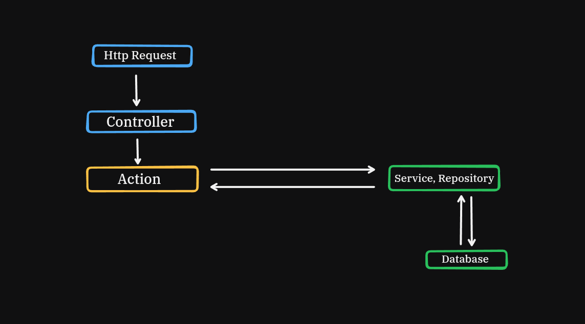

# Архітектурні шари та потік даних

## Опис
Даний документ описує архітектурний підхід, зони відповідальності різних шарів додатку та правила взаємодії між ними. Основна мета - підтримання **низької зв'язності коду** та дотримання принципів **SOLID**.

## Загальна схема взаємодії
**

---

### Опис шарів та їхні зони відповідальності

#### 1. HTTP-шар (Controllers & Requests)
* **Зона відповідальності:**
  * Валідація вхідних даних через кастомні `Form Requests`.
  * Маршрутизація та виклик відповідного бізнес-сценарію.
  * Повернення HTTP-відповіді (`JSON`, `Redirect` або `View`).
* > **Правило:** Контролери повинні бути максимально тонкими. Вони не містять бізнес-логіки та не працюють з базою даних напряму.

#### 2. Шар бізнес логіки (Actions)
* **Зона відповідальності:** Виконує **одну конкретну** бізнес-операцію.
* **Взаємодія:**
  * Приймає чисті, валідовані дані з контролера.
  * Оркеструє процес: викликає необхідні сервіси чи репозиторії.
* > **Правило:** Один екшен - одне завдання.

#### 3. Сервісний шар та Інфраструктура (Services & Repositories)
* **Сервіси (`Services`):** Містять перевикористовувано допоміжну логіку або певні розрахунки, які не прив'язані до одного конкретного екшену.
* **Репозиторії (`Repositories`):** Відповідають за ізоляцію роботи з базою даних.
* > **Правило:** Сервіси та репозиторії повертають дані назад в екшен, який уже вирішує, що з ними робити далі.

## Чому обрано саме такий підхід?
1. **Масштабованість:** Якщо якась бізнес-логіка зміниться, це торкнеться лише певної частини системи, а не зламає весь функціонал.
2. **Чітка структура:** новий розробник зможе легко зрозуміти як пов'язані між собою різні шари системи завдяки зручній архітектурі.
